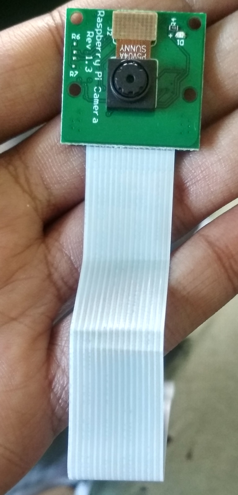
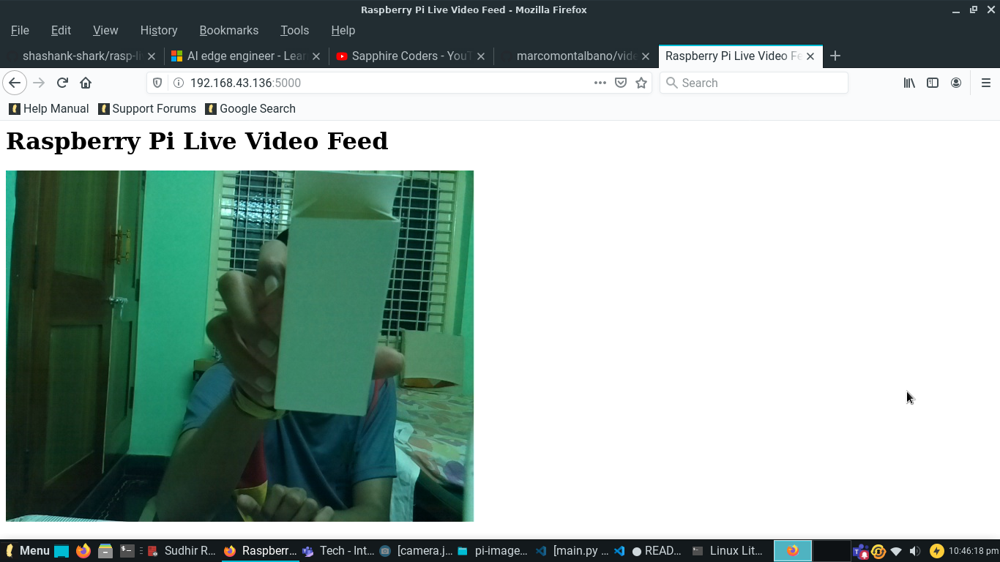

# rasp-live-feed-flask
Pi Camera Live streaming with Flask

## Dependencies included are:
1. opencv
2. flask
3. Flask_Basicauth
4. numpy

## Steps for running the project on Raspberry Pi
1. Clone the repository on your pi.<br> ```git clone https://github.com/shashank-shark/rasp-live-feed-flask.git```<br>
2. Connect your camera module to pi.
3. Run the project by ```python app.py```<br>

## Results
|   |   |
|---|---|